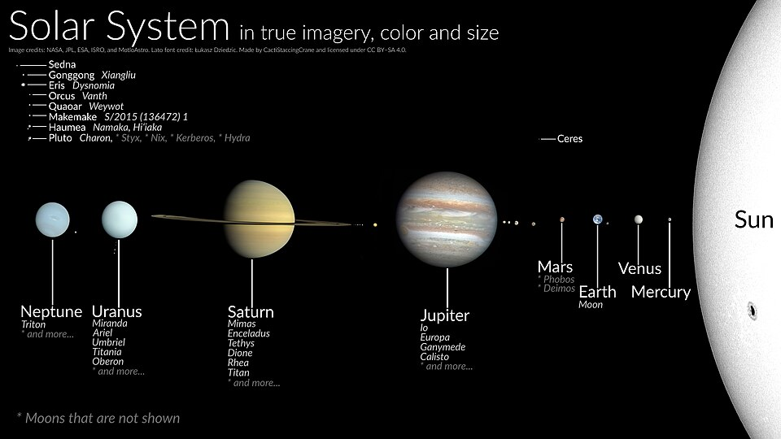
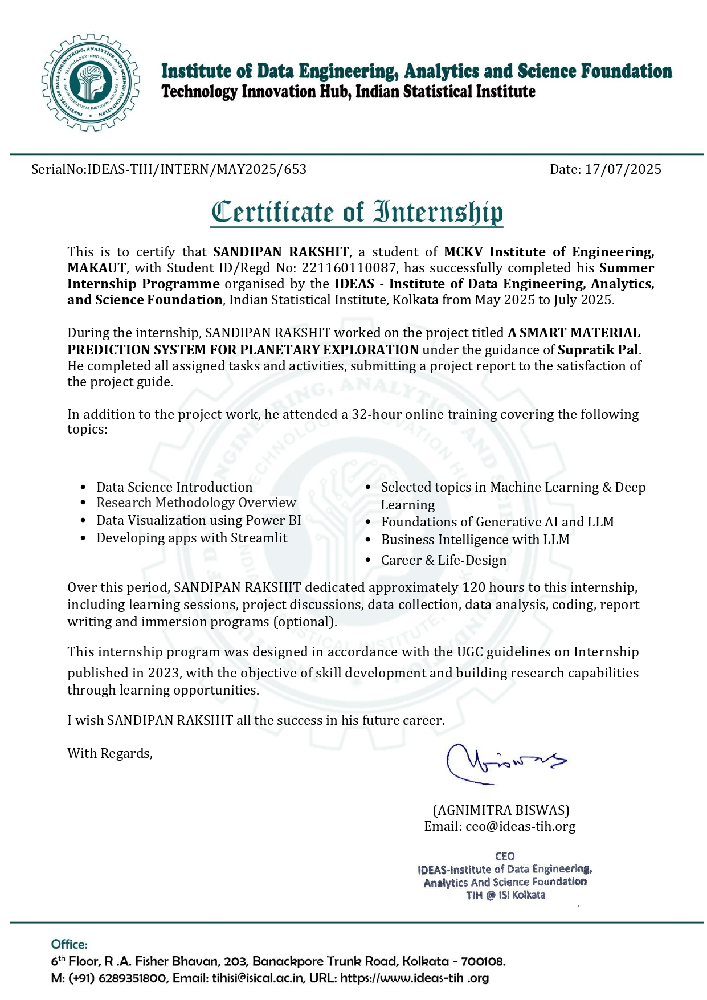

<h1 align="center">Planet Material Predictor</h1>

<p align="center">

</p>

<center> 

## Abstract:
The **Planet Material Predictor** is a data-driven system designed to forecast the material composition of terrestrial planets using seismic, thermal, and physical parameters. By leveraging both **statistical** and **machine learning techniques**, the project enables accurate predictions without relying on costly and complex spectroscopic methods.  
Data is sourced from trusted repositories such as **NASA Planetary Data System** and **ISRO mission archives**, augmented with synthetic datasets to address observational gaps. Key algorithms used include a **TensorFlow-based Multilayer Perceptron (MLP)** for material classification and **SARIMAX** for temporal forecasting of planetary surface temperatures.  
The resulting hybrid model aids planetary scientists and mission planners in **resource estimation**, **habitability assessment**, and **exploration prioritization**—providing a scalable and accessible framework for planetary material prediction.

</br>
</br>

<p align="center">

<p align="center">Indian Statistical Institute, Kolkata</p>
</p>

## Project Overview

The **Planet Material Predictor** combines seismic property analysis, thermal data modeling, and planetary classification to infer the probable material composition of terrestrial planets. The core goal is to develop a computationally efficient and scientifically sound system for **material and environmental prediction** in planetary exploration.

### Workflow

1. **Planet Classification**
   - Focused on terrestrial (rocky) planets such as Mercury, Venus, Earth, and Mars.
   - Applied selection criteria including solid lithosphere presence, available seismic data, and comparable physical conditions to Earth.

2. **Data Collection**
   - Retrieved seismic and environmental data from NASA PDS, InSight Mission Archive, and Kaggle Mars datasets.
   - Simulated 100,000 realistic planetary samples using probabilistic modeling for underrepresented conditions.

3. **Data Preprocessing**
   - One-hot encoded planet labels, label-encoded materials, imputed missing values, and standardized numerical features.
   - Removed low-variance or highly correlated features to improve prediction accuracy.

4. **Machine Learning Modeling**
   - **Material Prediction:** TensorFlow-based MLP with two hidden layers (256 and 128 neurons) using ReLU activation, trained on Earth-equivalent converted seismic features.
   - **Temperature Forecasting:** SARIMAX model integrating exogenous variables such as gravity and pressure for short-term predictions.

5. **Statistical Modeling**
   - Implemented SARIMA for univariate seasonal forecasting.
   - Extended to SARIMAX for incorporating external planetary conditions.

6. **Visualization & Interpretation**
   - Generated histograms, correlation matrices, seasonal climate trends, and material distribution plots.
   - Provided an **interactive Streamlit-based UI** for real-time material prediction.

### Technologies Used

- **Programming Language:** Python
- **Libraries:**
  - Pandas, NumPy, Scikit-learn, Matplotlib, Seaborn
  - TensorFlow 2.x for MLP modeling
  - Statsmodels for SARIMA/SARIMAX
- **Tools:**
  - Jupyter Notebook
  - Streamlit for interactive UI
  - GitHub for version control

### Results and Impact

The model achieved **85–90% accuracy** in classifying planetary materials and successfully captured short-term temperature trends with SARIMAX.  
This work demonstrates that **hybrid AI + statistical modeling** can serve as a low-cost, high-reliability alternative to traditional planetary composition studies, enhancing **mission planning**, **scientific discovery**, and **astroinformatics research**.

## Features

- **Hybrid Modeling:** Combines deep learning classification with statistical time series forecasting.
- **Earth-Equivalent Conversion:** Normalizes planetary features for cross-planet generalization.
- **Synthetic Data Generation:** Addresses observational scarcity using domain-informed simulations.
- **Interactive Prediction UI:** Enables user-driven exploration of planetary material predictions.

## Internship Certificate:

<p align="center">

</p>

## Quick Links:


[](Project_Report/Planet_Material_Predictor_report.pdf) 
[](Internship_certificate/SANDIPAN_RAKSHIT.pdf) 
[](https://github.com/CosmoCompute/planet-material-predictor)
[](Project_Report/Planet_Material_Predictor_report.pdf) 

## References Used:
- NASA Planetary Data System (PDS): https://pds.nasa.gov/  
- InSight Seismology Data: https://mars.nasa.gov/insight/mission/science/seismology/  
- Ehlmann, B. L., & Edwards, C. S. (2014). *Mineralogy of the Martian Surface*.  
- Sharma, S., et al. (2022). *Deep learning in planetary science: A review*.  
- Kaggle Mars Weather Dataset: https://www.kaggle.com/datasets/tejashvi14/mars-temperature-data  

## Authors

- Arijit Chowdhury – University of Calcutta  
- Swarnabha Halder – Sikkim Manipal Institute of Technology  
- Arnab Deogharia – Banaras Hindu University  
- Arya Singh – IIT Patna  
- Sandipan Rakshit – MCKV Institute of Engineering  
- Manisha Kumari – IIT Patna  

## Getting Started

To run the project locally:

```bash
# Clone the repository
git clone https://github.com/CosmoCompute/planet-material-predictor.git

# Navigate to project folder
cd planet-material-predictor

# Install dependencies
pip install -r requirements.txt

# Run the interactive UI
streamlit run app.py
```
**[Project Link...](https://github.com/CosmoCompute/planet-material-predictor)**
